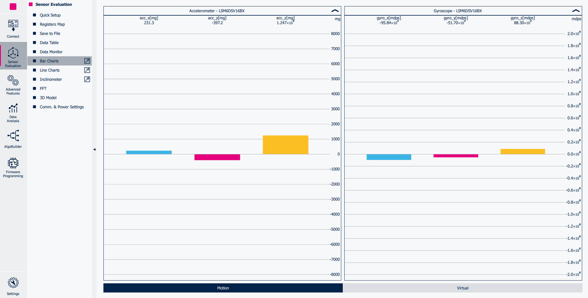

# Tutorial 1 - Introduction to ST's Finite State Machine (FSM)

This tutorial describes how to program the **Finite State Machine (FSM)** embedded in the ST sensors using MEMS Studio.

This tutorial explains the basic building blocks in designing a simple FSM with the goal of detecting free-fall events (0 g condition).

The purpose of this exercise is to learn how to use the FSM tool within MEMS Studio, better understand the UI and an introduction to basic functionality of the FSM.

The configurations implemented in this tutorial are available in the `tutorial_files` folder.

**Software**:

In order to easily program the **FSM** the **Advanced Features Section** of **MEMS Studio** will be utilized.

For more details on the software tool:

- [MEMS Studio](https://www.st.com/en/development-tools/mems-studio.html) is a desktop application that allows users to configure their sensors, display data in real time, analyze data in the frequency domain, design decision trees for the MLC, program the FSM, and configure the embedded logic.

**Hardware**:

In these tutorials we will be using the **LSM6DSV16BX inertial measurement unit (IMU)**, which features a 3-axis digital accelerometer and a 3-axis digital gyroscope.

However, these tutorials are aimed to work on most devices supporting the FSM, so you should be able to follow along regardless of sensor choice.

For more details on the hardware:

- ST resource page on [MEMS Sensors](https://www.st.com/mems)
- ST resource page on [MEMS Sensors Ecosystem for Machine Learning](https://www.st.com/content/st_com/en/ecosystems/MEMS-Sensors-Ecosystem-for-Machine-Learning.html)
- Application Note [AN5898](https://www.st.com/resource/en/application_note/an5898-lsm6dsv16bx-finite-state-machine-stmicroelectronics.pdf) on FSM embedded in [LSM6DSV16BX](https://www.st.com/en/mems-and-sensors/lsm6dsv16bx.html#overview)

## 1. Hardware and software setup

The first step is to set up the hardware and software tools.

**Hardware** used:

- [STEVAL-MKI109D](https://www.st.com/en/evaluation-tools/steval-mki109d.html) professional evaluation board for MEMS sensors, referenced as **Professional MEMS tool** in ST's documentation. It is based on the STM32H563ZI microcontroller and features a **DIL24 connector** which you can plug in supported **DIL24 adapter**. It is designed to help you evaluate our collection of MEMS sensors for automotive, consumer, and industrial applications.
- [STEVAL-MKI234KA ](https://www.st.com/en/evaluation-tools/steval-mki234ka.html) daughterboard with **LSM6DSV16BX** IMU sensor (referenced as **DIL24 adapter** in ST's documentation).
- USB C cable to connect the Professional MEMS tool motherboard to the PC.

**Software** needed:

- [MEMS Studio](https://www.st.com/en/development-tools/mems-studio.html) will be the desktop application we use to create and evaluate our FSM configurations.
- [STM32CubeProgrammer](https://www.st.com/en/development-tools/stm32cubeprog.html) is a software tool used to program STM32 products. We will use this to update our Professional MEMS tool firmware to the latest version.

Follow the procedure below to start working with **MEMS Studio** using the **Professional MEMS tool**:

1. Plug in the DIL24 LSM6DSV16BX adapter to the Professional MEMS tool motherboard and connect the motherboard to the PC using the USB C cable.

2. Run MEMS Studio and select *LSM6DSV16BX* from the *Device name* list and confirm by pressing the *Select* button.

3. Once selected you will be brought to the *Sensor Evaluation* tab. From here you can set the Data Rate and Full scale of the LSM6DSV16BX. For this tutorial we will be using 30 Hz and 2 g on the accelerometer with the gyroscope in power down.

4. Click on the *Start* button in the top left of the UI and navigate to the the *Bar Charts* tab to check the data in real-time.

## 2. FSM development

**MEMS Studio** provides a dedicated tool for FSM development, which can be run by clicking on the *Advanced Features* Sub Menu on the left hand side of the UI. From there you can select the *FSM* tool.

Once opened, the FSM tool allows the user to implement multiple FSM programs (up to 8 for the LSM6DSV16BX), configure the FSM function processing rate, enable / route interrupt events on the INT1 and / or INT2 pins.

The default FSM selected is the first one (*State Machine #1*) and the default processing rate is 30 Hz. And since you connected to MEMS Studio using the Professional MEMS tool + DIL24 adapter, the sensor drop-down list will automatically populate. There is no need to change any of these settings for this example.

Along with the FSM parameters the top bar also includes the *Converter, Long Counter, and Start address* subsections. You can ignore the *Long Counter* and *FSM Start address* sections for this example but more information on these options can be found in the MEMS Studio User Manual.

We will however use the *Converter* feature later on to determine the value to set for our threshold. The converter allows you to convert back and forth between floating-point values and their Float16 representation (also known as Half-Precision floating-point format). This is important since the FSM expects Float16 values for its variables.

Finally along the right hand side you will have your active parameters. This includes the *Status Data, Fixed Data, and Variable Data* sections.

The *Status Data* section includes the enablement and the routings (INT1 and/or INT2) of the single FSM. This setting will automatically set the required registers to handle the FSM interrupt for you and save those settings as part of your configuration.

The FSM supports two types of interrupt signals. One generated by the program flow and one when the FSM long counter reaches its timeout value.

For now we can set the FSM Status to Enabled and route the FSM Interrupt to INT1 by selecting Enabled and INT1.

The central column stores information about the Instructions section of the program. This section will automatically show new options as different Instructions are added to the program.

Finally you will have the *Variable Data* section. Currently it will not be visible because we have not added any instructions to the configuration therefore there are no variables to be edited/set. Once instructions that utilize this memory space are added, it will automatically populate. Once populated the user can adjust the variables to fit the programs needs.

## 3. Commands and RESET/NEXT Conditions

When building your FSM configuration you will utilize the Command and RESET/NEXT Condition instructions together to design your program.

When you click on the *+ button* (Add new state) at the bottom of the configuration tab a new STOP command will be added to the program flow. STOP is just one of many commands you have access to.

Each new instruction is represented by 1 (or more) lines in your configuration tab. From left to right each line shows: instruction number, instruction address, instruction type (Commands or RESET/NEXT Conditions), the instruction name, duplicate line, and delete line.

Commands (CMD) are used to modify the program behavior in terms of flow control, output, and synchronization. Commands are executed immediately and the program pointer (PP) is set to the next line automatically. They do not require a new sample to execute.

RESET/NEXT Conditions (RNC) are used to control the program flow itself. You can think of them as your state control within your program allowing you to transition from state to state.

By default the RNC waits to execute on a new sample being received. From there that sample is either compared to a threshold, zero crossing condition, or the timer value is decremented and compared to zero. It first checks if the Reset Condition is true: if so, the program pointer (PP) is set to the reset pointer (RP) value. If the Reset Condition was false, it then checks to see if the Next Condition is true, if so the program pointer (PP) is set to the next line. If both are false it waits on a new sample and tries again.

(Note: It is possible to execute multiple RNC on a single sample using THRXYZ. For more information refer to the AN for your sensor)

## 4. Simple Free-Fall Detector

In this tutorial we are going to cover a very simple implementation of a free-fall detector using the FSM. Keep in mind that ST sensors already have an embedded hardware block which implements free-fall detection that is low power and robust. The focus of this tutorial is not in the detection result, but rather to show an easy to understand example that utilizes many of the features discussed so far.

A simple free-fall detector can be implemented by comparing the norm of acceleration with a threshold. During a free-fall event all three axes of the accelerometer should approach 0 g, therefore we know norm will also converge on 0 g. We will use that knowledge to create our configuration.

Since free-fall can be defined by the norm (or all axis) dropping below a small threshold (0.3 g), the goal is for our program to generate an interrupt when that occurs. To do so we want to have our Next condition be true when a free-fall occurs.

To do this, let's add a new state by clicking the *Add new State button* at the bottom of the instruction panel (if you didn't already add a STOP earlier). By default the STOP command will populate.

Let's swap that to a RNC by clicking on the drop down currently labeled CMD and changing it to RNC.

From there let's change the first drop down (the RESET condition) to GNTH1.

The threshold nomenclature is as follows:
* The first letter G or L represents: ≥ or <
* The second letter N, L or R represents: Any axis, All axis, or Any axis with inverted threshold
* Finally TH1 and TH2 represent the variables Threshold 1 and Threshold 2

So our choice stands for (Any enabled axis ≥ threshold 1).

Let's set our threshold to 0.3 g. To do this we use the converter. Input the value 0.3 in the "Float" box and click the highlighted button *Float to Float16*. This will convert to the half-precision floating-point hex value 34CD which you can input into the *Thresh 1* variable that has populated in your Variable Data section on the right of the screen. Once inputted you should see the converted value in parenthesis next to the half-precision floating-point value.

Next we need to set the Mask for our input. The accelerometer is already set as the default signal and the default mask is already *Mask A*.

To set our mask we can refer to the above. The mask is represented by a 8-bit value, where each bit represents an axis (X, Y or Z) or the norm of the axes (V). For instance if we wanted to process the positive value of each axis we would have 10101000 (+X, +Y, +Z) for the accelerometer. Or A8h in hex. For our use case we are interested in the Norm or V+. 00000010 or 02h in hex. So we can input that in the Mask A Variable Data section

Keep in mind during program runtime the mask variable is copied to a temporary mask variable. So TempMask A assumes the value of Mask A. This allows you to store the results of the use of the mask. For example if we used the A8h mask example and only the Z and Y conditions were true the temporary mask would be updated to A0h. This temporary mask would keep this new value until a reset mask command was issued, a Reset condition is executed, or SRTAM1 command is used to reset mask on successful Next condition.

For our NEXT condition let's use a Timer. This will represent how many samples in a row do not satisfy the Reset condition. There are 4 timers available within the FSM. Timer 1 and 2 are 16 bit long timers. And timers 3 and 4 are 8 bit short timers. For our program we don't need a very long timer. So we will use timer 3 or TI3 in the drop down list.

Timers inside RNC work as follows:

When you move to the state in which the timer is located the Timer Counter (TC) will be set to the value referenced by the timer variable in that state. So for our example TC will be equal to the value stored in the variable Timer 3.

When a new sample is processed and you reach the timer state (In our use case if the norm is not greater than or equal to TH1) then you decrement TC. If TC=0 then the state is considered true. Each time you reset TC is reset. By default TC value is always reset upon entering a new state. You can change that functionality using the SCTC1 command, more information available in the AN for your part number.

Let's set the Timer 3 value to 01 so that we react quickly to the free-fall condition (at 30 Hz 1 sample gives us 33 ms latency for detection).

Let's simplify what exactly we have done so far using our first state. We created a RNC whose Reset condition is GNTH1 with a threshold of 0.3 g. This is going to reset when ever the Norm is greater than 0.3 g which in our use case means it will reset when not in free-fall. Our Next condition is represented by a timer with a value of 1. This means that the first new sample whose Norm is less than 0.3 g (free-fall) will make Reset=false and Next=true allowing us to move to the next state.

So now that we have the logic to determine whether or not we are in free-fall, all we need to do now is create the interrupt signal so that the sensor outputs that the condition has been met.

There are a few options here:
* OUTC: Outputs the temporary mask, generates an interrupt and goes to the next state
* CONT: Outputs the temporary mask, generates an interrupt and loops back to the reset pointer
* CONTREL: Does everything CONT does but also resets the temporary mask after outputting
* STOP: Outputs the temporary mask, generates an interrupt and disables the FSM

For our current use case there are no real differences between the CONT and CONTREL. This is because our Mask is only looking at the positive norm. So the TempMask A and the Mask A are always equal so issuing the REL command has no effect. So let's use the CONT command so we generate the interrupt and also loop back to the start of our program.

To do this add a new state to your program by using the *Add new State* button at the bottom of your instruction panel and choosing CONT from the drop down list.

The whole FSM should look like the following image.

In order to actually write the FSM to the LSM6DSV16BX, the user must press the *Write FSM Configuration to sensor* button. The sensor will be configured to detect free-fall events and route them to the INT1 pin. This configuration can be runtime tested using the *Testing* tab.

Since the free-fall detector works as expected, we can save it in a JavaScript Object Notation file (JSON) in order to be able to load this device configuration in the future. In order to do this:

1. Go back to *Configuration* tab.
2. Click on *Save Device Configuration* button.
3. Save it to the PC (e.g., *fsm_free_fall.json*). 

The **JSON** is a text file with a sequence of register addresses and corresponding values. It contains the full sensor configuration, including of course the FSM configuration and can be utilized in many of the tools included in MEMS Studio (i.e., Algobuilder and Sensor Evaluation) and can be converted to a header *.h* files to be conveniently included in C projects utilizing the Configuration Converter tool found in the Advanced features tab.

An example on how to use the generated *.h* file in a standard C driver is available in the [STMems_Standard_C_drivers repository](https://github.com/STMicroelectronics/STMems_Standard_C_drivers/blob/master/lsm6dsv16bx_STdC/examples/lsm6dsv16bx_fsm_fourd.c)

------

**More Information: [http://www.st.com](http://st.com/MEMS)**

**Copyright © 2025 STMicroelectronics**

