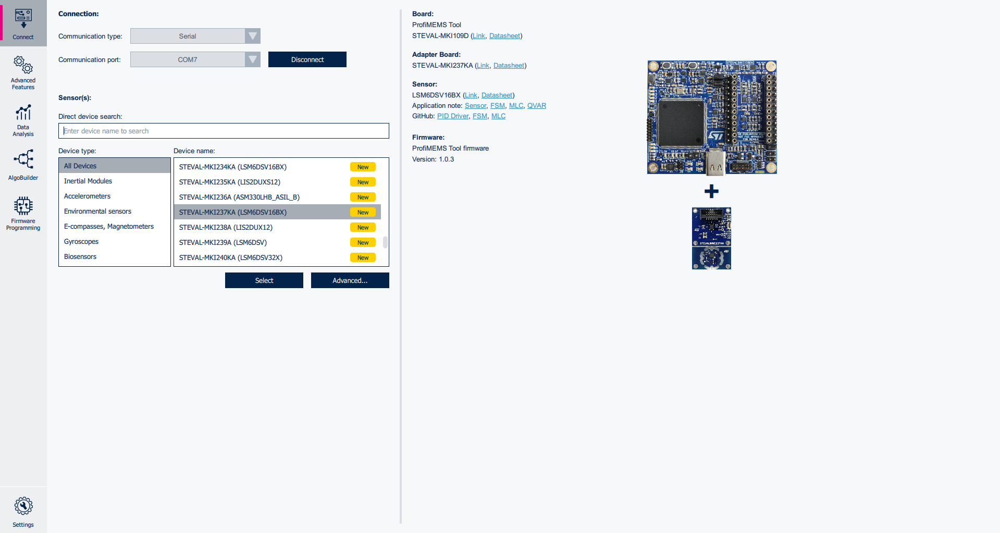
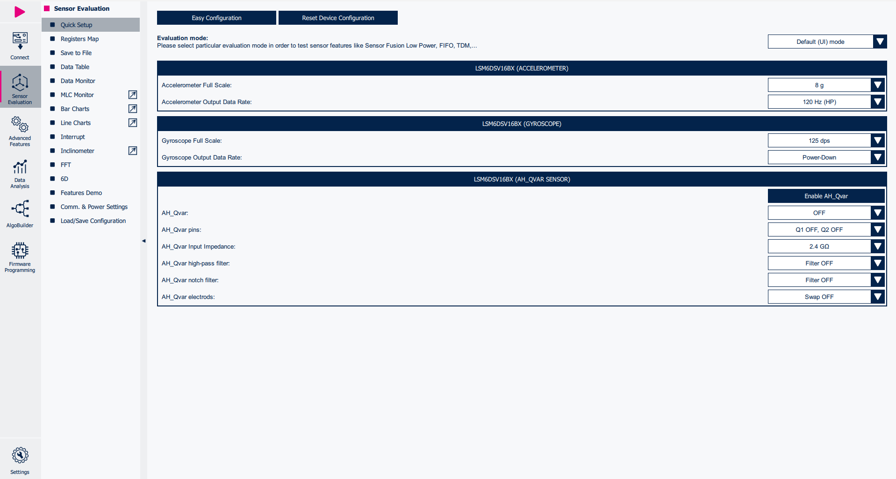
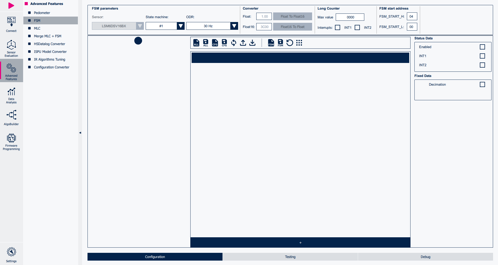
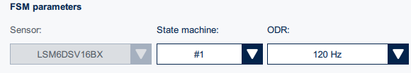
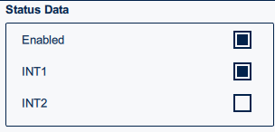
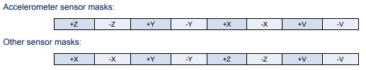
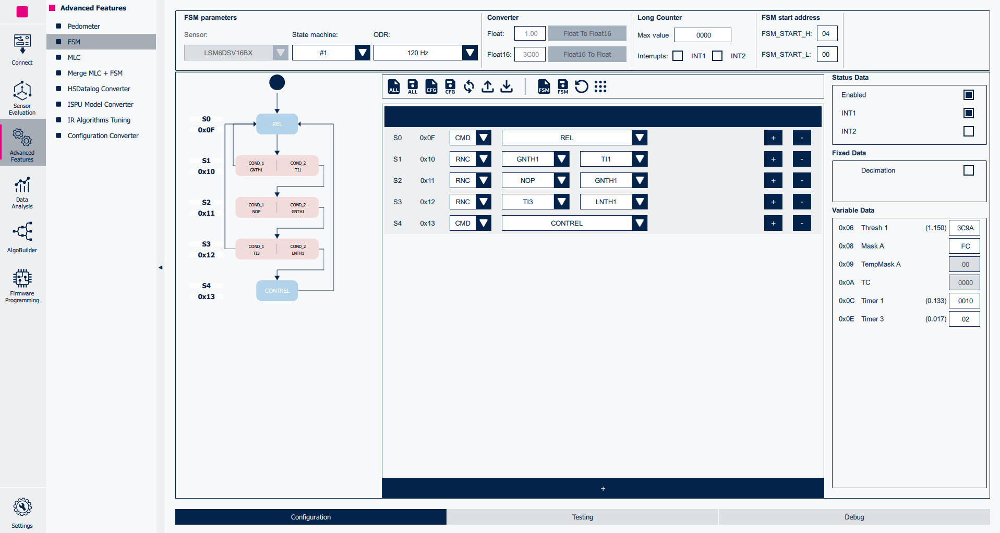
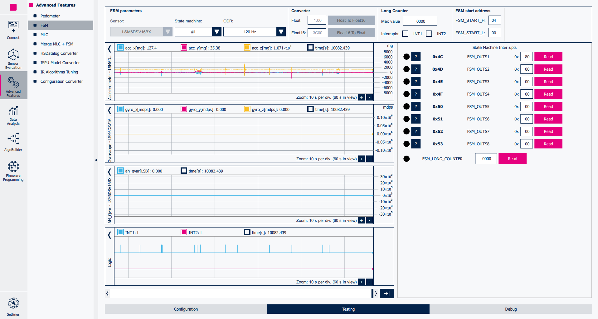
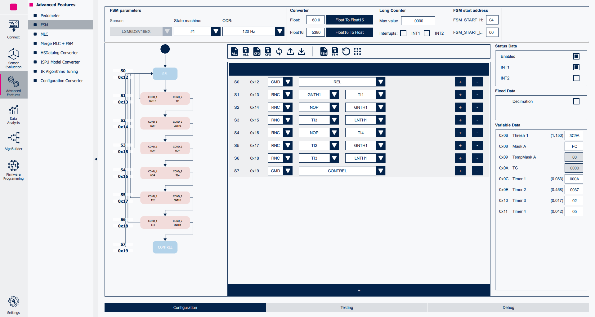
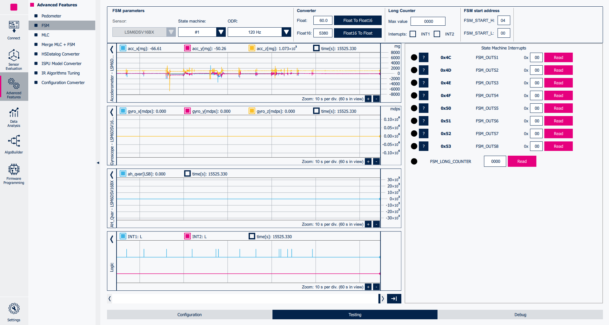

# Tutorial 2 - Temporary masks and Reset/Next conditions

This tutorial describes how to program the **Finite State Machine (FSM)** embedded in the ST sensors using MEMS Studio.

This tutorial expands on the previous tutorials deepening the understanding of Temporary Masks and Reset/Next Conditions. It focuses on the development process of a Tap and Double Tap detection program for the FSM, providing practical guidance and examples.

The configurations implemented in this tutorial are available in the `tutorial_files` folder.

**Software**:

In order to easily program the **FSM** the **Advanced Features Section** of **MEMS Studio** will be utilized.

For more details on the software tool:

- [MEMS Studio](https://www.st.com/en/development-tools/mems-studio.html) is a desktop application that allows users to configure their sensors, display data in real time, analyze data in the frequency domain, design decision trees for the MLC, program the FSM, and configure the embedded logic.

**Hardware**:

In these tutorials we will be using the **LSM6DSV16BX inertial measurement unit (IMU)**, which features a 3-axis digital accelerometer and a 3-axis digital gyroscope.

However, these tutorials are aimed to work on most devices supporting the FSM, so you should be able to follow along regardless of sensor choice.

For more details on the hardware:

- ST resource page on [MEMS Sensors](https://www.st.com/mems)
- ST resource page on [MEMS Sensors Ecosystem for Machine Learning](https://www.st.com/content/st_com/en/ecosystems/MEMS-Sensors-Ecosystem-for-Machine-Learning.html)
- Application Note [AN5898](https://www.st.com/resource/en/application_note/an5898-lsm6dsv16bx-finite-state-machine-stmicroelectronics.pdf) on FSM embedded in [LSM6DSV16BX](https://www.st.com/en/mems-and-sensors/lsm6dsv16bx.html#overview)

## 1. Hardware and software setup

The first step is to set up the hardware and software tools.

**Hardware** used:

- [STEVAL-MKI109D](https://www.st.com/en/evaluation-tools/steval-mki109d.html) professional evaluation board for MEMS sensors, referenced as **Professional MEMS tool** in ST's documentation. It is based on the STM32H563ZI microcontroller and features a **DIL24 connector** which you can plug in supported **DIL24 adapter**. It is designed to help you evaluate our collection of MEMS sensors for automotive, consumer, and industrial applications.
- [STEVAL-MKI234KA ](https://www.st.com/en/evaluation-tools/steval-mki234ka.html) daughterboard with **LSM6DSV16BX** IMU sensor (referenced as **DIL24 adapter** in ST's documentation).
- USB C cable to connect the Professional MEMS tool motherboard to the PC.

**Software** needed:

- [MEMS Studio](https://www.st.com/en/development-tools/mems-studio.html) will be the desktop application we use to create and evaluate our FSM configurations.
- [STM32CubeProgrammer](https://www.st.com/en/development-tools/stm32cubeprog.html) is a software tool used to program STM32 products. We will use this to update our Professional MEMS tool firmware to the latest version.

Follow the procedure below to start working with **MEMS Studio** using the **Professional MEMS tool**:

1. Plug in the DIL24 LSM6DSV16BX adapter to the Professional MEMS tool motherboard and connect the motherboard to the PC using the USB C cable.

2. Run MEMS Studio and select *LSM6DSV16BX* from the *Device name* list and confirm by pressing the *Select* button.

3. Once selected you will be brought to the *Sensor Evaluation* tab. From here you can set the Data Rate and Full scale of the LSM6DSV16BX. For this tutorial we will be using 120 Hz and 8 g on the accelerometer with the gyroscope in power down.

4. Click on the *Start* button in the top left of the UI and navigate to the the *Bar Charts* tab to check the data in real-time.

## 2. FSM development

**MEMS Studio** provides a dedicated tool for FSM development, which can be run by clicking on the *Advanced Features* Sub Menu on the left hand side of the UI. From there you can select the *FSM* tool.

Once opened, the FSM tool allows the user to implement multiple FSM programs (up to 8 for the LSM6DSV16BX), configure the FSM function processing rate, enable / route interrupt events on the INT1 and / or INT2 pins.

The default FSM selected is the first one (*State Machine #1*) and the default processing rate is 30 Hz. For simplicity, the FSM rate is changed to 120 Hz to match the sensor settings.

We should also enable INT1 in the Status Data Section.

In this tutorial we will be creating two configurations:
- A single tap example to build a foundation of understanding
- A double tap example that builds on the previous example

## 3. Single Tap

Before we start let's organize the requirements for our tap algorithm:

1. The first step is to start from a clean condition where the device is relatively stationary and there is no motion or tapping going on.
2. Then, we want to sense a spike above that threshold to capture the tap.
3. Finally, we want to confirm it was a tap and not just motion by checking that the acceleration on the **same** axis quickly falls under the threshold.

To accomplish step three we will need to utilize the temporary mask feature supported by ST's FSM. In tutorial 1 we utilized the mask to check the norm of acceleration to determine the freefall event but we did not utilize the temporary mask.

A quick refresher on Mask behavior:

To set our mask we can refer to the above. The mask is represented by an 8-bit value, where each bit represents an axis (X, Y or Z) or the norm of the axes (V). For instance if we wanted to process each axis of the accelerometer and its inverse we would have 11111100 (+Z, -Z, +Y, -Y, +X, -X), or FCh in hex.

Keep in mind during program runtime the mask variable is copied to a temporary mask. So TempMask A assumes the value of Mask A. This allows you to retain your original Mask configuration while also using the temporary mask to store which of the enabled axis met the Next Condition successfully.

This is important for our use case because we need to keep track of which axis sees a spike in acceleration so that we can check only that axis to determine if it was truly a tap or just motion.

As an example, if our tap was found on the +X axis the temporary mask would update to be 08h and the following RNC would only check the +X axis rather than the full original mask.

The temporary mask would keep the updated values until a reset mask command is issued, a Reset condition is executed, or SRTAM1 command is used to reset mask on successful Next condition.

To start our program let's include the command *REL*. This command resets the temporary axis mask information. While it won't be necessary for our program, it does allow this configuration to better integrate as part of a larger FSM configuration and as practice resetting temporary mask information before a function block that relies on temporary masks can avoid unintended interactions.

Next, let's refer back to our tap requirements:

1. The first step is to start from a clean condition where the device is relatively stationary and there is no motion or tapping going on.

To accomplish this let's make sure the device is under a chosen threshold on all axis for a specific time. We can use a RNC with greater than threshold 1 *GNTH1* as the Reset condition and timer 1 *TI1* as the Next condition. This will make the FSM reset when any axis is above the threshold and move into the tap logic after a chosen number of samples of being below the chosen threshold.

	GNTH1 | TI1

The longer the timer the more likely you are to get robust results but at the cost of latency between taps. For our use case we will use 10 (000Ah) samples or 83 ms at 120 Hz.

The threshold is also based on the use case. Since we are checking all axis as discussed in the mask section earlier we will need the device fairly stationary to determine taps. For Mask A we will be using FCh and for the Thresh 1 we will use 3C9A for our Half floating point value or 1.15 g.

Because the gravity vector will be seen on at least one axis, the threshold needs to be larger than 1g. If you knew which axis your taps would occur on you could set this value more accurately. Keep in mind the closer to the resting state of axis you set this threshold to the more likely you are to trigger the threshold with noise or a spurious offset, which leads to a false positive. Inversely if one only wants to capture strong taps, threshold can be set even larger.

Now that we have our stationary condition confirmed, next let's check for a tap:

2. Then, we want to sense a spike above that threshold to capture the tap.

Since we have already been stationary for a set period of time we only need to check to see if a spike happened.

For this we can use the RNC again but this time with a No Operation or *NOP* as our Reset condition and a greater than threshold 1 *GNTH1* as our Next condition. This will have the program wait for a spike to occur after the previous stationary condition has been met. And since we are checking the threshold on the Next condition rather than the Reset condition, the temporary mask is updated. This means which ever axis the spike occurs on is now the only axis represented in the updated temporary mask.

	NOP | GNTH1

Finally we can check our last condition:

3. Finally, we want to confirm it was a tap and not just motion by checking that the acceleration on the **same** axis quickly falls under the threshold.

Unlike the last condition we do not want to use the NOP command for the Reset condition because unlike waiting for the tap to happen the tap itself should not last a long time. A normal tap will have a duration of a few samples at most while general motion will usually last much longer.

To accomplish this we will use a very small timer. A timer of 2 samples works well for this. While a timer of 1 also makes sense and is probably more accurate, it is rare a non tap-like motion ever lasts for less than 2 samples. Therefore if the value of the axis goes above the threshold and then falls below it within 2 more samples we can conclude it's a tap.

Let's use timer 3 *TI3* as the Reset condition with the value of 02 samples or 17 ms. For our Next condition we want to check if it's below the stationary threshold on the axis that spiked. Since the temporary mask was updated and saved in the previous step this is really easy and can be accomplished using the Less than Threshold 1 or *LNTH1* since we are using the updated mask to only check on the activated axis.

	TI3 | LNTH1

Finally let's add our last command to loop back to the start CONTREL. This will also generate our interrupt letting the host know that a tap was successful and updates the corresponding OUTS register for the State Machine number we are using. We can check this value if we are interested in knowing which axis the tap occurred on. We use CONTREL instead of CONT to reset the temporary masks.

	CONTREL

Our final configuration looks as below:

We can save our configuration in a JavaScript Object Notation file (JSON) in order to be able to load this device configuration in the future. In order to do this:

1. Click on *Save Device Configuration* button.
2. Save it to the PC (e.g., *fsm_single_tap.json*).
3. Then write the configuration to the sensor using *Write FSM Configuration to Sensor* button

You can test the configuration in the *Testing* tab at the bottom of the screen.

## 4. Double Tap

Now that we have a working Single Tap configuration let's build on it to create our Double Tap configuration.

The first step is to remove the *CONTREL* command so that we are no longer looping the program after the first tap is complete.

From here your options really open up for how you want to handle the timing and requirements for the second tap. We will cover a few optional instructions you can add before the second tap part of the program to adjust how the double tap functions.

The first optional step is adding a Release *REL* command. This will allow the second tap to be on a different axis from the fist tap in cases where that is relevant. Keep in mind if you are planning on adding a stationary condition between the two taps having the REL command before the stationary condition will force the stationary condition to pass on all axis of the Mask A not just the one the first tap was on.

Next we can add a forced timer between taps, also known as debouncing. This will force the taps to be a certain amount of samples apart to avoid vibrations from the first tap to falsely trigger the second tap. To accomplish this add a RNC condition with No Operation *NOP* as the Reset condition and Timer 4 *TI4* as the Next condition. Then set T4 to the minimum number of samples you wish to have between taps.

Finally you can also add another quiet condition here by using the RNC condition with greater than threshold 1 *GNTH1* as the Reset condition and Timer 4 *TI4* as the Next condition. This creates a forced timer between taps that also requires movement on the masked input to be below the threshold for a specific number of samples.

You can mix and match all three of these but do keep in mind that if you use the *NOP* timer between taps with the forced stationary condition that the number of samples represented by timer 4 will be doubled since it is used twice. Also this would be our recommended order in which you would use these if you planned to use all three.

For our example we will just use the forced wait timer between taps to act as debouncing. So add a RNC with No Operation *NOP* as the Reset condition and Timer 4 *TI4* as the Next condition. We will use a value of 5 samples or 42 ms for timer 4. This sets the minimum number of samples between taps.

	NOP | TI4

Next we have the start of the second tap. Unlike for the first tap we are not willing to wait forever for the tap to occur. So instead we will use a timer. In this case Timer 2 *TI2* since depending on your use case the fact timer 1 and 2 are 16-bit instead of 8-bit like timer 3 and 4 could come in handy in this program.

	TI2 | GNTH1

So let's add the RNC with timer 2 *TI2* as the Reset condition and greater than threshold 1 *GNTH1* as the Next condition. Let's set timer 2 to 55 samples (0037h) or 458 ms at 120 Hz. This value sets the max amount of time between taps as 500 ms when you take into account the forced wait we added of 5 samples for the minimum time.

Variables:
	Minimum time between taps *TI4*
	Maximum time between taps *TI2 + TI4*

Next we check to see the tap is complete. This is the same as the first tap. So let's add a RNC and set timer 3 *TI3* as the Reset condition and less than threshold 1 *LNTH1* as the Next condition.

	TI3 | LNTH1

Finally we can add the *CONTREL* command to loop our program, generate the interrupt and release our temporary masks.

	CONTREL

If you want to customize the program more you can change some of the thresholds to threshold 2. For instance if you want your tap value to be different than your stationary condition. Or if you want the values between the first and second tap to be different. If you want to do both you will need to utilize SELTHR3 or STHR1. More information on those commands can be found in the FSM Application Note for your device.

Our finalized program is shown below:

Now that you have your double tap configuration you can save it:

1. Click on *Save Device Configuration* button.
2. Save it to the PC (e.g., *fsm_double_tap.json*).
3. Then write the configuration to the sensor using *Write FSM Configuration to Sensor* button.

You can test the configuration in the *Testing* tab at the bottom of the screen.

The **JSON** is a text file with a sequence of register addresses and corresponding values. It contains the full sensor configuration, including of course the FSM configuration and can be utilized in many of the tools included in MEMS Studio (i.e., Algobuilder and Sensor Evaluation) and can be converted to a header *.h* files to be conveniently included in C projects utilizing the Configuration Converter tool found in the Advanced features tab.

An example on how to use the generated *.h* file in a standard C driver is available in the [STMems_Standard_C_drivers repository](https://github.com/STMicroelectronics/STMems_Standard_C_drivers/blob/master/lsm6dsv16bx_STdC/examples/lsm6dsv16bx_fsm_fourd.c)

------

**More Information: [http://www.st.com](http://st.com/MEMS)**

**Copyright © 2025 STMicroelectronics**

