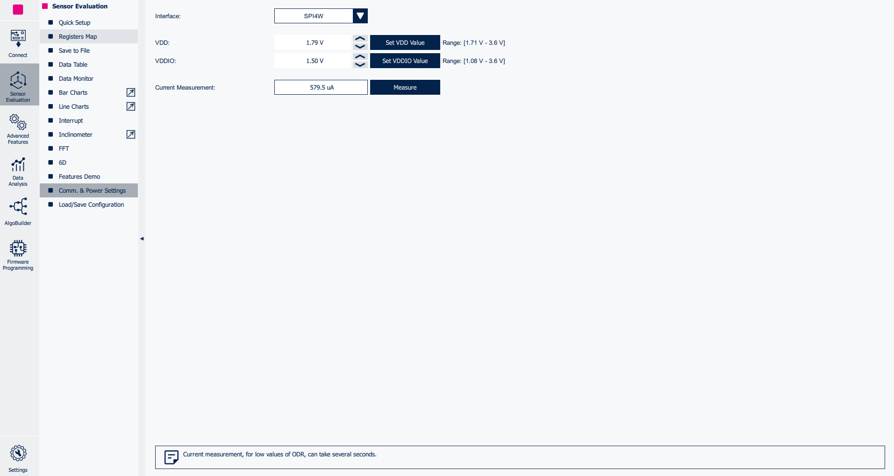

# Tutorial 3 - Adaptive Self-Configuration feature

This tutorial describes how to program the **finite state machine (FSM)** for using the **adaptive self-configuration (ASC)** feature of some ST sensors.

The usage of this feature allows reconfiguring the device automatically, without requiring any intervention from the host processor. The reconfiguration may include a change in the sensor control registers (for example, to change the sensor power mode, the sensor full scale, and so forth) or the enabling/disabling of the embedded functions (for example, turning on/off other FSMs, enabling or disabling the MLC, and so forth).

This example shows how to use the ASC feature to reduce the current consumption of the LSM6DSV16BX device by changing the accelerometer and gyroscope power modes based on movement or a stationary condition.

The configurations implemented in this tutorial are available in the `tutorial_files` folder.

**Software**:

In order to easily program the **FSM** the **Advanced Features Section** of **MEMS Studio** will be utilized.

For more details on the software tool:

- [MEMS Studio](https://www.st.com/en/development-tools/mems-studio.html) is a desktop application that allows users to configure their sensors, display data in real time, analyze data in the frequency domain, design decision trees for the MLC, program the FSM, and configure the embedded logic.

**Hardware**:

In these tutorials we will be using the **LSM6DSV16BX inertial measurement unit (IMU)**, which features a 3-axis digital accelerometer and a 3-axis digital gyroscope.

However, these tutorials are aimed to work on most devices supporting the FSM, so you should be able to follow along regardless of sensor choice. This tutorial in particular requires the chosen device to support the ASC feature.

For more details on the hardware:

- ST resource page on [MEMS Sensors](https://www.st.com/mems)
- ST resource page on [MEMS Sensors Ecosystem for Machine Learning](https://www.st.com/content/st_com/en/ecosystems/MEMS-Sensors-Ecosystem-for-Machine-Learning.html)
- Application Note [AN5898](https://www.st.com/resource/en/application_note/an5898-lsm6dsv16bx-finite-state-machine-stmicroelectronics.pdf) on FSM embedded in [LSM6DSV16BX](https://www.st.com/en/mems-and-sensors/lsm6dsv16bx.html#overview)

## 1. Hardware and software setup

The first step is to set up the hardware and software tools.

**Hardware** used:

- [STEVAL-MKI109D](https://www.st.com/en/evaluation-tools/steval-mki109d.html) professional evaluation board for MEMS sensors, referenced as **Professional MEMS tool** in ST's documentation. It is based on the STM32H563ZI microcontroller and features a **DIL24 connector** which you can plug in supported **DIL24 adapter**. It is designed to help you evaluate our collection of MEMS sensors for automotive, consumer, and industrial applications.
- [STEVAL-MKI234KA ](https://www.st.com/en/evaluation-tools/steval-mki234ka.html) daughterboard with **LSM6DSV16BX** IMU sensor (referenced as **DIL24 adapter** in ST's documentation).
- USB C cable to connect the Professional MEMS tool motherboard to the PC.

**Software** needed:

- [MEMS Studio](https://www.st.com/en/development-tools/mems-studio.html) will be the desktop application we use to create and evaluate our FSM configurations.
- [STM32CubeProgrammer](https://www.st.com/en/development-tools/stm32cubeprog.html) is a software tool used to program STM32 products. We will use this to update our Professional MEMS tool firmware to the latest version.

Follow the procedure below to start working with **MEMS Studio** using the **Professional MEMS tool**:

1. Plug in the DIL24 LSM6DSV16BX adapter to the Professional MEMS tool motherboard and connect the motherboard to the PC using the USB C cable.

2. Run MEMS Studio and select *LSM6DSV16BX* from the *Device name* list and confirm by pressing the *Select* button.

3. Once selected you will be brought to the *Sensor Evaluation* tab. From here can change the sensor settings to 8 g 120 Hz (HP) for the Accelerometer and 2000 dps 120 Hz (HP) for the Gyroscope

4. Click on the *Start* button in the top left of the UI and navigate to the the *Bar Charts* tab to check the data in real-time.

## 2. FSM development

**MEMS Studio** provides a dedicated tool for FSM development, which can be run by clicking on the *Advanced Features* Sub Menu on the left hand side of the UI. From there you can select the *FSM* tool.

Once opened, the FSM tool allows the user to implement multiple FSM programs (up to 8 for the LSM6DSV16BX), configure the FSM function processing rate, enable / route interrupt events on the INT1 and / or INT2 pins.

The default FSM selected is the first one (*State Machine #1*) and the default processing rate is 30 Hz. For simplicity, the FSM rate is changed to 120 Hz to match the sensor settings.

In this tutorial the FSM we are creating will be divided in two blocks based on the accelerometer sensor data:
- When the device is moving, the gyroscope sensor is turned on and the accelerometer is set in high-performance mode, allowing the SFLP to keep tracking the orientation of the device.
- When the device is stationary, the gyroscope is turned off and the accelerometer is set in low-power mode to save power, and the SFLP output is kept constant.

## 3. ASC Feature

The *SETR* command can be used to enable the ASC (Adaptive Self Configuration) Feature.

This feature allows the device to reconfigure itself without any host intervention.

This works by choosing a register address and value to be set to that address.

The available list of registers that can be written to the LSM6DSV16BX is shown below. Check the FSM Application Note for your device for a similar table.

To utilize the ASC functionality the FSM_WR_CTRL_STATUS bit of the CTRL_STATUS (1Ah) register must be enabled. We will cover how to accomplish this later in the tutorial.

The REG_ADDR Value of the SETR command must match an available Register Address(FSM) as shown in the table above. If this parameter is set to 0x00 it will use the REG_VAL value as a write bitmask for the next SETR command.

The REG_VAL Value of the SETR command is the new value to be written in the 1st parameter register address.

In our program we want to swap the accelerometer between Low-Power mode and High-Performance Mode at 120 Hz, while also toggling the Gyro between Power Down and High-Performance at 120 Hz.

The tables below were pulled from the Application Note for the LSM6DSV16BX. If you are following along using different hardware please refer to the Application Note for your device.

As shown above the Accelerometer ODR and Power Modes are stored in the CTRL1 register of the device. Referencing the ASC table, we can see that the CTRL1 register is represented by 10h for the REG_ADDR.

Then for the accelerometer low-power mode let's use Low-Power Mode 1 at 120 Hz, which means a value of 46h for REG_VAL.

For the accelerometer high-Performance let's use High-Performance mode at 120 Hz. which means a value of 06h for REG_VAL.

We can do the same process for the gyroscope. The gyroscope ODR and Power Modes are stored in the CTRL2 register of the device or 11h for the REG_ADDR.

For our low-power mode we just want the gyroscope off, which means a value of 00h for REG_VAL.

For High-Performance we want the gyroscope in High-performance mode at 120 Hz, which means a value of 06h for REG_VAL.

With that understanding let's make our program.

## 4. ASC Program

The goal for this program is to use the ASC feature to swap between two states automatically. One in which we utilize the Accelerometer and Gyroscope in high-performance mode during device motion. With a second low-power state for when the device is stationary for 2 seconds.

We want this program to start automatically so we will enable the FSM Status in the top right *Status Data* box.

The program will transition between the two states automatically with no input from the host MCU, therefore we don't need to generate interrupts on change between these states.

To accomplish this we can use the Mask Interrupt command (MSKIT) to disable the FSM interrupt. MSKIT masks the interrupt generation when the OUTS register value is updated (i.e., when CONT, CONTREL and OUTC are used) allowing you to output or loop without generating an interrupt.

Add the *MSKIT* command to the program using the *Add new State* button.

	MSKIT

We also don't want to run the MSKIT every time we loop the program so let's set the Reset Pointer after this instruction.

To do this add the *SRP* command to the program.

	SRP

This command sets the programs reset pointer to the next address (RP=PP+1). This modifies the starting point of the program in subsequent loops.

Now that we have taken control of the interrupt generation we can focus on our two program states.

Let's start with the Stationary/Low-Power State since that will be our default state.

To start let's add a state and choose the RNC. The goal of this part of the program is to check if we are below a specific threshold for a specific time and if we are to move into a low-power configuration.

So let's pick GNTH1 and TI1 as our RNC constraints. This allows us to choose how stationary we want the device and for how long the device must be stationary before we move into the Low-Power state. For this example let's choose 1.1 g of Norm on the accelerometer and for 240 samples (or 2 seconds at 120 Hz), or F0h in hex.

	GNTH1 | TI3

We can use the converter to convert 1.1 g to 3C66h. You can use this value to update your variable data. Since we are checking the norm of acceleration we should also apply a mask of 02h (V+).

Now that we are in our stationary state let's use the ASC feature to configure our sensors to match.

Start by adding the *SETR* command to the workspace.

We will use this SETR to configure the accelerometer for Low-Power Mode. Using previous section as reference our Low-Power state for accelerometer is REG_ADDR 10h and REG_VAL 46h:

	SETR
		10h
		46h

Add another SETR command for the gyroscope and configure it for Low-Power state with the values REG_ADDR 11h and REG_VAL 00h:

	SETR
		11h
		00h

With that our two sensors are configured to the desired ODR and Full Scale for this state.

(First part of Program State shown below for Reference)

Next we need to create the RNC to transition to the High-Performance state. To do this we can just reverse our RNC condition from earlier since the threshold between the two states can be the same. We also should also probably remove the timer from this RNC. When putting the device into Low-Power mode it's suggested to have a bit of a delay so that the gyroscope doesn't power down when a single sample happens to fall below the threshold during use. The same is not true when moving into High-Performance mode. You want the device to transition quickly when it leaves the stationary state to give the user the best experience.

To accomplish this we can use the RNC using *NOP* (No operation) which always computes as false. So if placed in the Reset condition only the NEXT operation is evaluated. If placed in the Next condition only the RESET condition is evaluated.

So let's add a new *RNC* to our program that has the Reset condition as NOP and the Next condition as GNTH1.

	NOP | GNTH1

This serves as the transition to the High-Performance state. Let's use ASC to update our sensor configurations to match.

Start by adding the *SETR* command to the workspace.

We will use this SETR to configure the accelerometer for High-Performance Mode. Using previous section as reference our High-Performance state for accelerometer is REG_ADDR 10h and REG_VAL 06h:

	SETR
		10h
		06h

Add another *SETR* command for the gyroscope and configure it for High-Performance state with the values REG_ADDR 11h and REG_VAL 06h:

	SETR
		11h
		06h

Finally we can add the CONT command to move the PP (Program Pointer) back to the RP (Reset Pointer) and since we used *MSKIT* earlier in our program no interrupt will be generated

	CONT

(Second part of Program State shown below for Reference)

We can save our configuration in a JavaScript Object Notation file (JSON) in order to be able to load this device configuration in the future. In order to do this:

1. Click on *Save Device Configuration* button.
2. Save it to the PC (e.g., *fsm_asc.json*).
3. Then write the configuration to the sensor using *Write FSM Configuration to Sensor* button.

In order to actually enable the FSM capability of writing the CTRL1/2 registers (so enabling the ASC feature), the FSM_WR_CTRL_EN bit of the FUNC_CFG_ACCESS (01h) register must be set to 1. Let's open the *Registers* tab and write the value 08h in the register 01h.

More information about the ASC feature, including the list of registers that can be configured by the FSM, can be found in the LSM6DSV16BX FSM Application Note.

Once the ASC feature is enabled, let's click on the *Comm. & Power Settings* button available in the *Sensor Evaluation* tab to measure the current consumption of the LSM6DSV16BX device during the two conditions below:
- When the board is moving, the current consumption is ~600 uA, since both the accelerometer and the gyroscope sensors are configured in high-performance mode at 120 Hz.
- When the board is stationary for at least 2 seconds, the current consumption drops down to ~30 uA, since the accelerometer is configured in low-power mode 1 and the gyroscope is turned off.

You can also view the change using the *Data Monitor* to watch the gyroscope power down in real time (the gyroscope data will become static since no new samples are filling the registers) and start back up again on movement.

We can now save the complete device configuration with the FSM write capabilities enabled by the ASC feature:

1. Click on the *Load/Save* device configuration tab in the Sensor Evaluation Menu.
2. Click on the *Save* button.
3. Save it to the PC (e.g., *device_asc.json*).

The **JSON** is a text file with a sequence of register addresses and corresponding values. It contains the full sensor configuration, including of course the FSM configuration and can be utilized in many of the tools included in MEMS Studio (i.e., Algobuilder and Sensor Evaluation) and can be converted to a header *.h* files to be conveniently included in C projects utilizing the Configuration Converter tool found in the Advanced features tab.

An example on how to use the generated *.h* file in a standard C driver is available in the [STMems_Standard_C_drivers repository](https://github.com/STMicroelectronics/STMems_Standard_C_drivers/blob/master/lsm6dsv16bx_STdC/examples/lsm6dsv16bx_fsm_fourd.c)

------

**More Information: [http://www.st.com](http://st.com/MEMS)**

**Copyright © 2025 STMicroelectronics**

