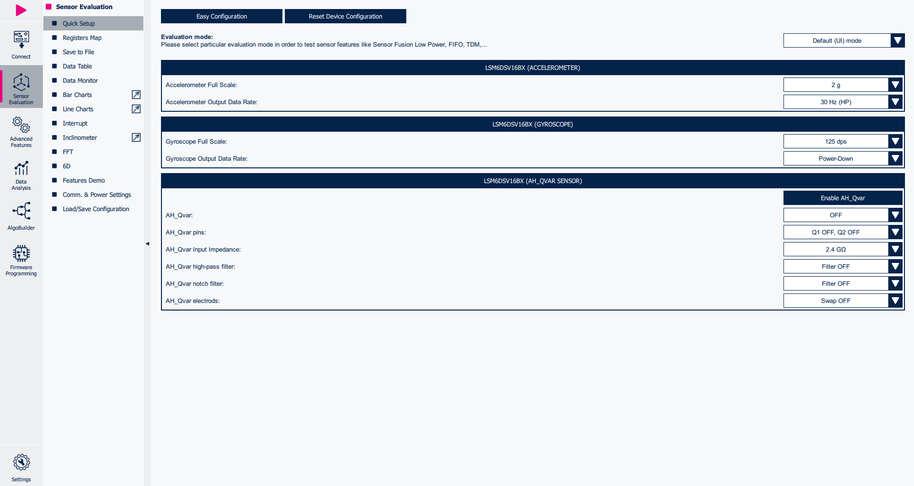
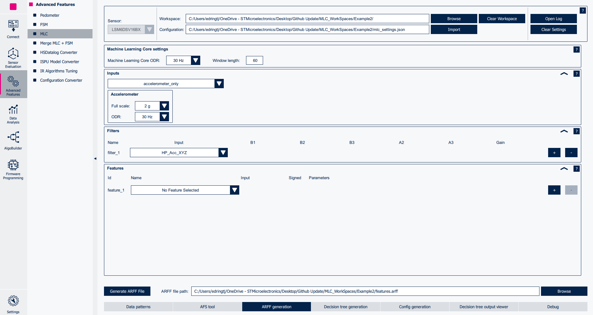

# Tutorial 4 - Utilizing MLC filters inside the FSM

This tutorial describes how to program the **Finite State Machine (FSM)** and **Machine Learning Core (MLC)** embedded in ST sensors.

The combination of these features provides incredible flexibility for customized motion-pattern recognition in an ultra-low-power domain.

This example explains how to configure the **FSM** to implement a wake-up gesture and how to improve it by pre-processing the accelerometer signal thanks to **MLC** filtering capabilities.

The configurations implemented in this tutorial are available in the `tutorial_files` folder.

**Software**:

In order to easily program the **FSM** the **Advanced Features Section** of **MEMS Studio** will be utilized.

For more details on the software tool:

- [MEMS Studio](https://www.st.com/en/development-tools/mems-studio.html) is a desktop application that allows users to configure their sensors, display data in real time, analyze data in the frequency domain, design decision trees for the MLC, program the FSM, and configure the embedded logic.

**Hardware**:

In these tutorials we will be using the **LSM6DSV16BX inertial measurement unit (IMU)**, which features a 3-axis digital accelerometer and a 3-axis digital gyroscope.

However, these tutorials are aimed to work on most devices supporting the FSM, so you should be able to follow along regardless of sensor choice.

For more details on the hardware:

- ST resource page on [MEMS Sensors](https://www.st.com/mems)
- ST resource page on [MEMS Sensors Ecosystem for Machine Learning](https://www.st.com/content/st_com/en/ecosystems/MEMS-Sensors-Ecosystem-for-Machine-Learning.html)
- Application Note [AN5898](https://www.st.com/resource/en/application_note/an5898-lsm6dsv16bx-finite-state-machine-stmicroelectronics.pdf) on FSM embedded in [LSM6DSV16BX](https://www.st.com/en/mems-and-sensors/lsm6dsv16bx.html#overview)

## 1. Hardware and software setup

The first step is to set up the hardware and software tools.

**Hardware** used:

- [STEVAL-MKI109D](https://www.st.com/en/evaluation-tools/steval-mki109d.html) professional evaluation board for MEMS sensors, referenced as **Professional MEMS tool** in ST's documentation. It is based on the STM32H563ZI microcontroller and features a **DIL24 connector** which you can plug in supported **DIL24 adapter**. It is designed to help you evaluate our collection of MEMS sensors for automotive, consumer, and industrial applications.
- [STEVAL-MKI234KA ](https://www.st.com/en/evaluation-tools/steval-mki234ka.html) daughterboard with **LSM6DSV16BX** IMU sensor (referenced as **DIL24 adapter** in ST's documentation).
- USB C cable to connect the Professional MEMS tool motherboard to the PC.

**Software** needed:

- [MEMS Studio](https://www.st.com/en/development-tools/mems-studio.html) will be the desktop application we use to create and evaluate our FSM configurations.
- [STM32CubeProgrammer](https://www.st.com/en/development-tools/stm32cubeprog.html) is a software tool used to program STM32 products. We will use this to update our Professional MEMS tool firmware to the latest version.

Follow the procedure below to start working with **MEMS Studio** using the **Professional MEMS tool**:

1. Plug in the DIL24 LSM6DSV16BX adapter to the Professional MEMS tool motherboard and connect the motherboard to the PC using the USB C cable.

2. Run MEMS Studio and select *LSM6DSV16BX* from the *Device name* list and confirm by pressing the *Select* button.

3. Once selected you will be brought to the *Sensor Evaluation* tab. From here you can set the Data Rate and Full scale of the LSM6DSV16BX. For this tutorial we will be using 30 Hz and 2 g on the accelerometer with the gyroscope in power down.

4. Click on the *Start* button in the top left of the UI and navigate to the the *Bar Charts* tab to check the data in real-time.

## 2. Wake-up FSM development

**MEMS Studio** provides a dedicated tool for FSM development, which can be run by clicking on the *Advanced Features* Sub Menu on the left hand side of the UI. From there you can select the *FSM* tool.

Once opened, the FSM tool allows the user to implement multiple FSM programs (up to 8 for the LSM6DSV16BX), configure the FSM function processing rate, enable / route interrupt events on the INT1 and / or INT2 pins.

The default FSM selected is the first one (*State Machine #1*) and the default processing rate is 30 Hz. There is no need to change them for this example.

A simple wake-up gesture can be implemented by comparing the current accelerometer signal with a threshold. The aim is to generate an interrupt signal if the current accelerometer sample is greater than a threshold.

To start we can use the Reset/Next Condition to determine when the accelerometer signal crosses a threshold.

Add a new state to the workspace using the *Add new state* bar near the bottom of the UI.

Choose RNC and the options NOP for the Reset condition and GNTH1 for the Next condition. This will have the program pointer (PP) wait at the first address until the Next condition is satisfied. We will use the threshold of 1.1 g since moving the device from stationary will cross that threshold consistently.

	NOP | GNTH1

We want to check the norm of acceleration so we will set Mask A to 02h (V+).

To calculate the threshold value in half-precision floating-point format we can use the converter at the top of the screen to convert 1.1 to 3C66h.

We can then use CONTREL to loop the program resetting the Mask, setting the PP back to the first address, and generating an interrupt.

	CONTREL

With that in mind we should Enable the FSM and choose INT1 as our interrupt in the Status Data section of the UI.

The whole FSM should look like the following image.

In order to actually write the FSM to the LSM6DSV16BX, the user must press the *Write FSM Configuration to sensor* button. The sensor will be configured to detect *wake-up* events and route them to the INT1 pin. This configuration can be tested at runtime using the *Testing* tab.

Since the wake-up works as expected, we can save it in a JavaScript Object Notation file (JSON) in order to be able to load this device configuration in the future. In order to do this:

1. Go back to *Configuration* tab.
2. Click on *Save Device Configuration* button.
3. Save it to the PC (e.g., *fsm_wake_up_no_filter.json*).

## 3. MLC filtering capabilities

The Machine Learning Core can be programmed to filter the signal which is input to the FSM.

In this example, we need to high-pass filter the acceleration data: so, we will generate an MLC configuration containing a high-pass filter.

**MEMS Studio** provides a dedicated tool for MLC configuration, which can be run by clicking on the *Advanced Features* button available in the left toolbar and navigating to the *MLC* tab.

In this example we only want to utilize the MLC ability to process data using Filters. For that reason we don't need to capture or analyze data. We can configure the MLC as follows:

1. Select *LSM6DSV16BX* device in the sensor drop down list.

2. Click the *Decision tree generation* tab and change the number of decision trees to 0.

3. Click on the *ARFF generation* tab at the bottom of the UI.

4. Select *30 Hz* MLC output data rate (i.e., internal processing rate for MLC block).

5. Select *Accelerometer only*, configured with full scale of 2 g and output data rate of 30 Hz.

6. In the filter submenu select HP_Acc_XYZ.

7. Select *Config Generation* tab at the bottom of the UI and select the button to Generate Config File.

8. Export your MLC filter configuration in json format to the location of your FSM project and name it something recognizable (e.g., *mlc_hp_xyz_filter.json*).

## 4. Merge FSM and MLC configurations

In section 2 we generated a simple wake-up configuration for the FSM and section 3 we generated an MLC configuration that filters data.

In this section, we are going to fuse them in a single empowered configuration.

In order to do this, the first step is to configure the FSM to use filtered accelerometer signal as input. For this reason, we will need to modify the original FSM configuration.

Let's add a state to the top of our configuration. The easiest way to do this is by duplicating the state currently at the top of our configuration by clicking on the *Duplicate State* button (+) on the right hand side of the state.

We then can change that state to the CMD *SINMUX* (Signal Mux).

So far we have just been using the raw accelerometer data (which is the default source) so we didn't have the need to worry about choosing a new source. SINMUX allows us to choose a different input source for the current state machine. The options for SINMUX are device dependent so make sure to check the FSM Application Note for your device.

For the device in this tutorial (LSM6DSV16BX) the SINMUX information is shown below:

We are going to use the first filtered signal from the MLC. So the value we will use is 03h for the SINMUX since that corresponds to the accelerometer filtered signal.

Since we are using a high-pass filter, the DC component due to gravity will be removed. Because of this we need to update our threshold to reflect this to be 0.1 g (2E66h).

The new FSM would be like the one in the image below:

The FSM is written to the device by clicking the *Write FSM Configuration* button and it can be saved by clicking the *Save Device Configuration* button (e.g., *wake_up_sinmux.json*).

If testing it now, we should not get any interrupt, because the MLC filter configuration has not been loaded yet.

In order to do this, we need to merge the MLC and FSM configurations (previously saved as *json* files). Under the *Advanced Features* tab, a dedicated tool is available by clicking the *Merge MLC+FSM* button in the bottom right view.

This tool allows selecting both an FSM tool generated and an MLC tool generated json files and merging them in a single device configuration file by following the steps below:

1. Load the MLC tool generated json file (e.g., *mlc_hp_xyz_filter.json*)
2. Load the FSM tool generated json file (e.g., *fsm_wake_up_sinmux.json*)
3. Click on *Merge MLC + FSM configurations* button and save the device configuration on the PC (e.g., *device_wake_up.json*).

The new generated json (e.g., *wake_up.json*) can now be loaded in order to configure the LSM6DSV16BX with the new MLC + FSM configuration.

In order to do this navigate to the *Sensor Evaluation* tab, open the *Load / Save* tab, click on the *Load* button and select the desired json file, whose configuration will be immediately loaded in the connected LSM6DSV16BX device.

FSM behavior can be tested as previously shown, opening the *FSM* tool and selecting the *Testing* tab near the bottom of the UI or by using the Interrupt tab in the Sensor Evaluation Menu

The **JSON** is a text file with a sequence of register addresses and corresponding values. It contains the full sensor configuration, including of course the FSM configuration and can be utilized in many of the tools included in MEMS Studio (i.e., Algobuilder and Sensor Evaluation) and can be converted to a header *.h* files to be conveniently included in C projects utilizing the Configuration Converter tool found in the Advanced features tab.

An example on how to use the generated *.h* file in a standard C driver is available in the [STMems_Standard_C_drivers repository](https://github.com/STMicroelectronics/STMems_Standard_C_drivers/blob/master/lsm6dsv16bx_STdC/examples/lsm6dsv16bx_fsm_fourd.c)

------

**More Information: [http://www.st.com](http://st.com/MEMS)**

**Copyright © 2025 STMicroelectronics**
