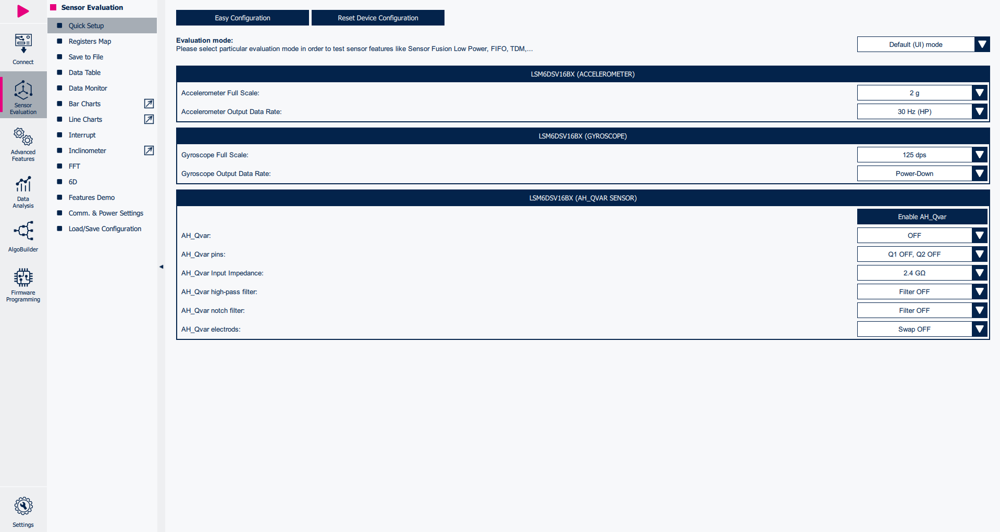
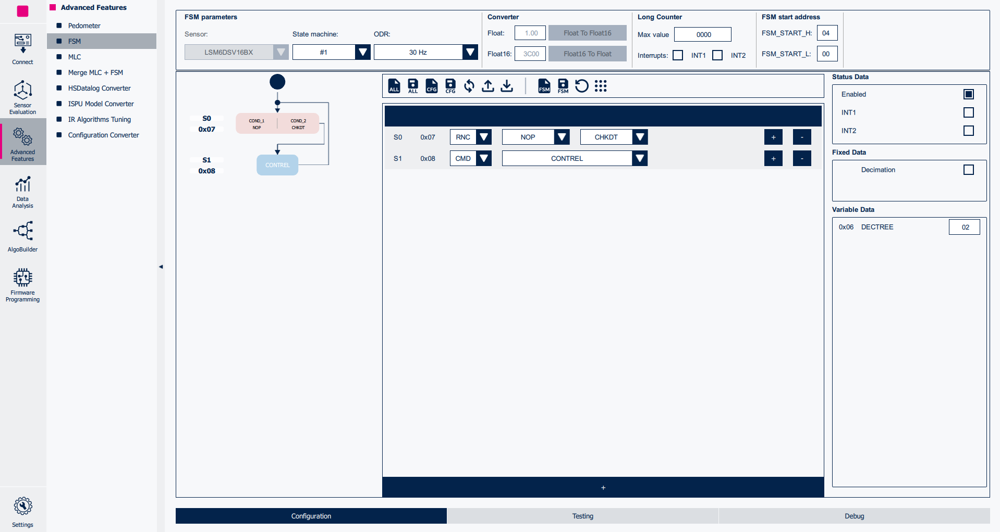
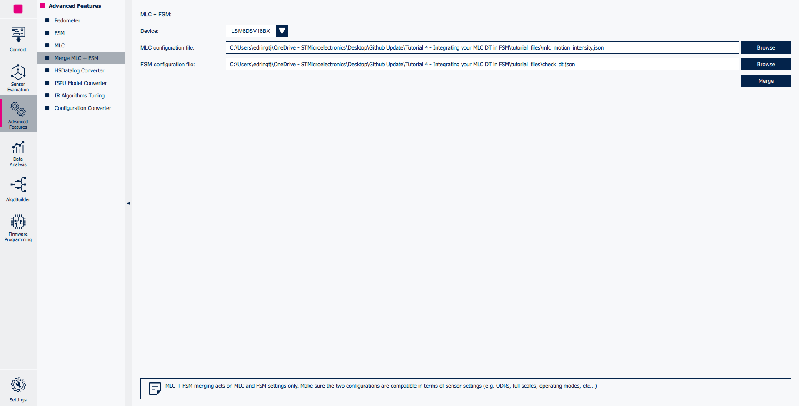
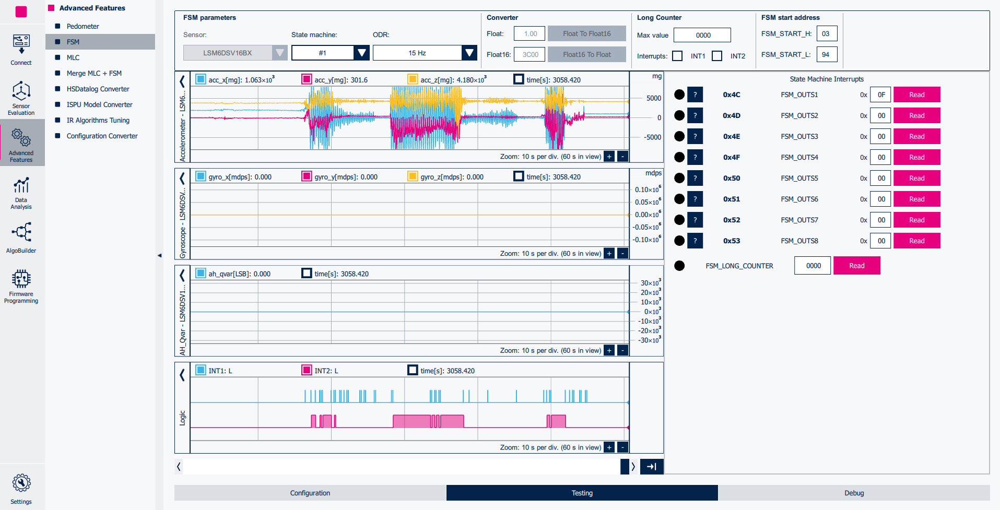
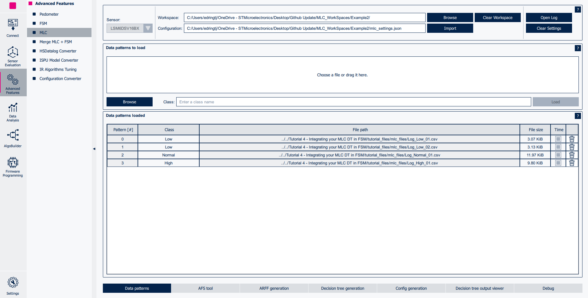
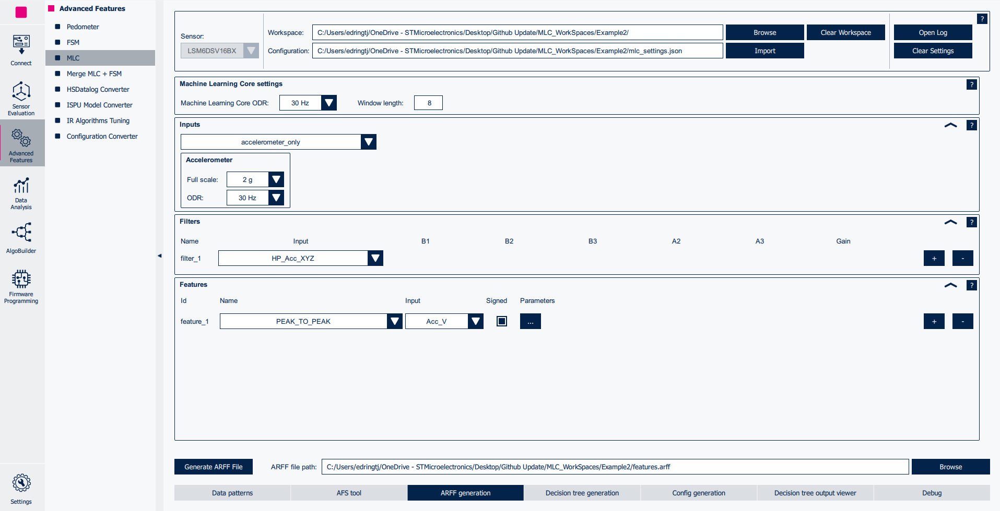
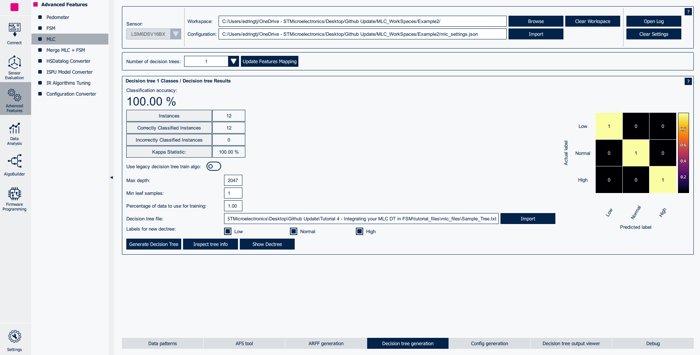
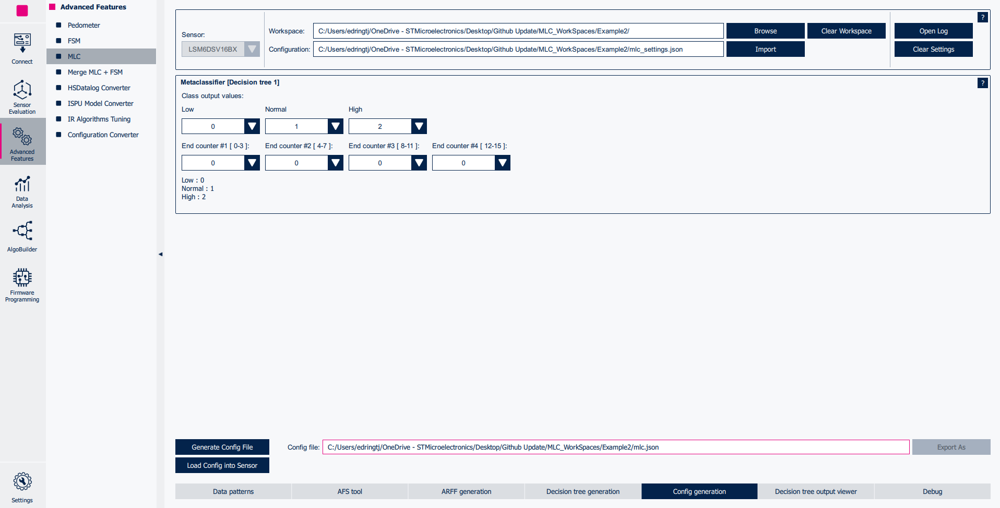

# Tutorial 5 - Integrating an MLC decision tree in FSM

This tutorial describes how to program the **Finite State Machine (FSM)** and **Machine Learning Core (MLC)** embedded in ST sensors.

The combination of these features provides incredible flexibility for customized motion-pattern recognition in an ultra-low-power domain.

This example explains how to configure the **FSM** to process **MLC** output (i.e., check the output value of a decision tree and generate an interrupt when it corresponds to the expected value).

The configurations implemented in this tutorial are available in the `tutorial_files` folder.

**Software**:

In order to easily program the **FSM** the **Advanced Features Section** of **MEMS Studio** will be utilized.

For more details on the software tool:

- [MEMS Studio](https://www.st.com/en/development-tools/mems-studio.html) is a desktop application that allows users to configure their sensors, display data in real time, analyze data in the frequency domain, design decision trees for the MLC, program the FSM, and configure the embedded logic.

**Hardware**:

In these tutorials we will be using the **LSM6DSV16BX inertial measurement unit (IMU)**, which features a 3-axis digital accelerometer and a 3-axis digital gyroscope.

However, these tutorials are aimed to work on most devices supporting the FSM, so you should be able to follow along regardless of sensor choice.

For more details on the hardware:

- ST resource page on [MEMS Sensors](https://www.st.com/mems)
- ST resource page on [MEMS Sensors Ecosystem for Machine Learning](https://www.st.com/content/st_com/en/ecosystems/MEMS-Sensors-Ecosystem-for-Machine-Learning.html)
- Application note [AN5898](https://www.st.com/resource/en/application_note/an5898-lsm6dsv16bx-finite-state-machine-stmicroelectronics.pdf) on FSM embedded in [LSM6DSV16BX](https://www.st.com/en/mems-and-sensors/lsm6dsv16bx.html#overview)

## 1. Hardware and software setup

The first step is to set up the hardware and software tools.

**Hardware** used:

- [STEVAL-MKI109D](https://www.st.com/en/evaluation-tools/steval-mki109d.html) professional evaluation board for MEMS sensors, referenced as **Professional MEMS tool** in ST's documentation. It is based on the STM32H563ZI microcontroller and features a **DIL24 connector** which you can plug in supported **DIL24 adapter**. It is designed to help you evaluate our collection of MEMS sensors for automotive, consumer, and industrial applications.
- [STEVAL-MKI234KA ](https://www.st.com/en/evaluation-tools/steval-mki234ka.html) daughterboard with **LSM6DSV16BX** IMU sensor (referenced as **DIL24 adapter** in ST's documentation).
- USB C cable to connect the Professional MEMS tool motherboard to the PC.

**Software** needed:

- [MEMS Studio](https://www.st.com/en/development-tools/mems-studio.html) will be the desktop application we use to create and evaluate our FSM configurations.
- [STM32CubeProgrammer](https://www.st.com/en/development-tools/stm32cubeprog.html) is a software tool used to program STM32 products. We will use this to update our Professional MEMS tool firmware to the latest version.

Follow the procedure below to start working with **MEMS Studio** using the **Professional MEMS tool**:

1. Plug in the DIL24 LSM6DSV16BX adapter to the Professional MEMS tool motherboard and connect the motherboard to the PC using the USB C cable.

2. Run MEMS Studio and select *LSM6DSV16BX* from the *Device name* list and confirm by pressing the *Select* button.

3. Once selected you will be brought to the *Sensor Evaluation* tab. From here you can set the Data Rate and Full scale of the LSM6DSV16BX. For this tutorial we will be using 30 Hz and 2 g on the accelerometer with the gyroscope in power down.

4. Click on the *Start* button in the top left of the UI and navigate to the the *Bar Charts* tab to check the data in real-time.

## 2. Load an MLC configuration file

First of all, we need to load an existing previously generated MLC configuration file. This can be done by loading a json file.

In this example, *mlc_motion_intensity.json* is loaded, containing a simple decision tree which detects three levels of motion intensity, based on peak-to-peak acceleration signals. The output classes are:

* 00h, low intensity
* 01h, normal intensity
* 02h, high intensity

If you are using a different sensor than the LSM6DSV16BX unfortunately the premade configuration will not work as expected for you. We have added a subsection to the bottom of this tutorial and included all the required files for you to be able to quickly recreate your own configuration in the tutorial files folder in the `mlc_files` subfolder.

The configuration file can be loaded following the procedure below:

1. Navigate to *Sensor Evaluation* and click on the *Load/Save Configuration*
2. Click on the *Load* button
3. Select the *mlc_motion_intensity.json* file

After loading the json file, the configuration can be tested by opening both the *Interrupt* and the *Data* tools from the left toolbar.

In this configuration, the MLC interrupt signal is routed to the INT1 pin: an interrupt pulse is generated each time the detected class changes.

The currently detected class is shown in the *Data Monitor* tab of Sensor Evaluation, specifically in the *Decision Tree Output Subsection* view. In this example, only the first cell updates its value, since the MLC is configured for using one decision tree only.

## 3. FSM development

**MEMS Studio** provides a dedicated tool for FSM development, which can be run by clicking on the *Advanced Features* Sub Menu on the left hand side of the UI. From there you can select the *FSM* tool.

Once opened, the FSM tool allows the user to implement multiple FSM programs (up to 8 for the LSM6DSV16BX), configure the FSM function processing rate, enable / route interrupt events on the INT1 and / or INT2 pins.

The default FSM selected is the first one (*State Machine #1*) and the default processing rate is 30 Hz. There is no need to change them for this example.

In this example, we want to configure the State Machine #1 for checking if the output of the motion intensity classifier is equal to 02h (i.e., high intensity) and generating an interrupt on the INT2 pin when this condition occurs.

The FSM in addition to the accelerometer, gyroscope, external sensor and filtered data processing, can also check if the result of any decision tree is the expected one by using the *CHKDT* condition found within the RESET/NEXT (RNC) option.

To start let's add a new state using the *Add new state* button found near the bottom of the UI.

We want to check if a specific condition is met from our MLC configuration so let's select the RNC option and choose NOP as the Reset condition. We want our program to wait for the correct output so there is no need to reset. For our Next condition let's choose the CHKDT (Check Decision Tree) option.

	NOP | CHKDT

You will notice that instead of the usual mask and threshold options in the Variable Data section we are instead presented with a *DECTREE* variable option.

This parameter expects 2 values:

The first represented by the left nibble contains the identifier of the decision tree you wish to check the output of. In our case we are only using a single decision tree so the value will be 0h. If you were using 3 for example and you wished to check the output of the third tree you would need to use the value 2h.

The second value is the output class value selected in the metaclassifier section of the Config Generation step of the MLC creation tool. As stated above our decision tree was configured as:
* 00h, low intensity
* 01h, normal intensity
* 02h, high intensity
So let's pick 2h to represent high intensity.

Our combined value is 02h and we can update the *DECTREE* data variable to match.

We can then add *CONTREL* to loop the program resetting the Mask, setting the PP back to the first address, and generating an interrupt.

	CONTREL

Finally make sure the *FSM Status* is Enabled and we are routing the FSM interrupt to INT2.

The whole FSM should look like the following image.

Without the MLC loaded there is no real way to test this configuration yet. So let's save for now

1. Click on *Save Device Configuration* button.
2. Save it to the PC (e.g., *fsm_check_dt.json*).

## 4. Merge FSM and MLC configurations

In section 3. an FSM configuration has been added on top of an existing MLC configuration. Anyway, when we saved the *fsm_check_dt.json* file, only the FSM configuration was saved on the PC. For this reason, if the *fsm_check_dt.json* is loaded on a new device or after **MEMS Studio** reboot, no interrupt will be generated (due to the the fact that the MLC configuration is missing).

In order to do this, we need to merge the MLC and FSM configurations (previously saved as *json* files). Under the Advanced Features tab, a dedicated tool is available by clicking the *Merge MLC+FSM* button in the bottom right view.

This tool allows selecting both an FSM tool generated and an MLC tool generated json files and merging them in a single device configuration file by following the steps below:

1. Load the MLC tool generated json file (e.g., *mlc_motion_intensity*)
2. Load the FSM tool generated json file (e.g., *fsm_check_dt.json*)
3. Click on the *Merge MLC + FSM configurations* button and save the device configuration on the PC (e.g., *device_high_intensity.json*)

The newly generated json (e.g., *device_high_intensity.json*) can now be loaded in order to configure the LSM6DSV16BX with the new MLC + FSM configuration.

In order to do this, open the *Load / Save* tab of the *Sensor Evaluation* tab, click on the *Load* button and select the desired json file, whose configuration will be immediately loaded in the connected LSM6DSV16BX device.

You can then view the output of the configuration in *FSM testing* tab (as shown below) or the *Sensor Evaluation Interrupt* tab. Interrupt 1 will represent when the MLC output changes and interrupt 2 will show when the MLC output is High intensity.

The **JSON** is a text file with a sequence of register addresses and corresponding values. It contains the full sensor configuration, including of course the FSM configuration and can be utilized in many of the tools included in MEMS Studio (i.e., Algobuilder and Sensor Evaluation) and can be converted to a header *.h* files to be conveniently included in C projects utilizing the Configuration Converter tool found in the Advanced features tab.

An example on how to use the generated *.h* file in a standard C driver is available in the [STMems_Standard_C_drivers repository](https://github.com/STMicroelectronics/STMems_Standard_C_drivers/blob/master/lsm6dsv16bx_STdC/examples/lsm6dsv16bx_fsm_fourd.c)

## Appendix: Creating the MLC Motion Intensity

As stated above included below is a quick tutorial on generating your own *mlc_motion_intensity.json* configuration for the MLC.

Included in the tutorial files is the `mlc_files` subfolder. Inside are the logs used to train the DT captured on the LSM6DSV16BX at 2 g and 30 hz. Also included is a *sample_tree.txt* you can use to quickly train your own configuration.

Navigate to the MLC tab of the advanced features menu:

1. Select your sensor device in the sensor drop down list.

2. Upload the two data patterns labeled *log_low_1* and *log_low_2* using the Browse button. And Enter a class name of "Low" and click load.

3. Upload the the data pattern labeled *log_normal_01* using the Browse button. And Enter a class name of "Normal" and click load.

4. Upload the the data pattern labeled *log_high_01* using the Browse button. And Enter a class name of "High" and click load.

5. Click on the *ARFF Generation* tab at the bottom of the UI. On this screen choose your MLC ODR as 30 Hz to match the accelerometer. Since we want the results to update quickly choose a window length of 8, which is large enough to capture the Peak-to-Peak of the shaking motion.

6. For Inputs choose Accelerometer Only with a Full scale of 2 g and an ODR of 30 Hz.

7. For Features choose PEAK_TO_PEAK with the input as the Variance of Acceleration (Acc_V).

8. You can now Generate the ARFF file using the button at the bottom of the UI. Your view should look similar to the one below.

9. Now click on the *Decision Tree Generation* tab at the bottom of the UI. You can either make your own or import the premade tree using the File. When loading the Tree you can remap the configuration to yours using the Update Button (if needed).

10. Finally in the *Config Generation* tab you can set your *Class output* values. By default they will be 0,4,8. But for our example we used 0,1,2. Either way works but remember if you change to 0,4,8 you will have to update the CHKDT Variable value to match. End counters can be left as 0 for this example. Once done you can generate your config file to be used in place of the included one.

------

**More Information: [http://www.st.com](http://st.com/MEMS)**

**Copyright © 2025 STMicroelectronics**
